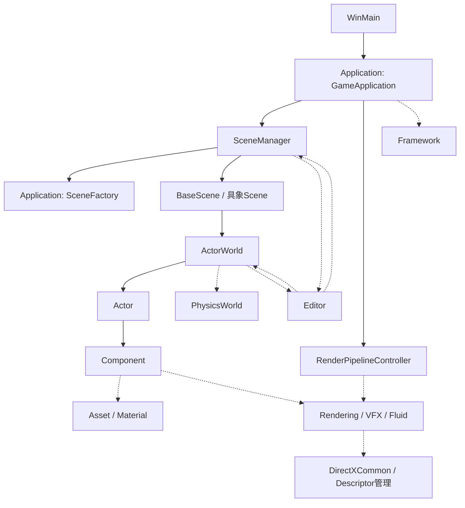

# Engine構造・依存関係調査

## 調査基準と範囲

- 基準: 2026-08-27にfetchしたmaster `d472d306`。作業ブランチは `codex/engine-dependency-audit`。
- 開発計画は [Production Engine Roadmap](ProductionEngineRoadmap.md)、工程と検証の状態は [進捗管理](ProductionEngineProgress.md) に分離する。
- `Project/Engine` / `Project/ApplicationLayer` のC++ソース799ファイルを対象に、include、起動・終了、Scene/Actor/Component、GPU所有者を静的に調査した。外部ライブラリは棚卸し対象外。
- 静的調査はGPUの実動作・リークなしを証明しない。未実行の確認を完了扱いにしない。

## 責務境界と今回の判断

| 層 | 担当 | 現状と境界 |
| --- | --- | --- |
| Core | 数学、時間、ジョブ、メモリ、OS基盤 | `Engine/Core/Application/Framework` は実際には描画・Scene Streaming・Editorを組み立てる上位処理で、Coreという所有定義より責務が広い |
| Engine Runtime | Actor/Component、Scene/Physics、描画、Asset、再利用可能なGameplay/VFX機構 | `Engine/Gameplay` はTag/Event/Attribute/Abilityなど汎用機構。ゲーム固有のScene登録・開始Scene選択は含めない |
| Gameplay / Application | ゲーム固有のScene、Actor登録、起動設定、EngineとEditorの接続 | `ApplicationLayer` が担当。ただし基準版の `GameApplication` はEngine/Coreにあり、Applicationの `SceneFactory.h` を直接includeしていた |
| Editor | 編集UI、選択、Gizmo、Undo/Redo、PIE、プレビュー、編集要求 | RuntimeからEditorを参照する既存経路が残る。Releaseで非表示になることと、コンパイル上の独立性は別 |

`GameApplication` はSceneManagerとRenderPipelineControllerを所有し、具象SceneFactoryと開始Sceneを選ぶ**アプリケーションの組立箇所**である。既存クラスを `ApplicationLayer` へ移すだけで確認済みのEngine→Application逆依存を解消できる。仮想API、Scene/Actorの所有、更新・描画・終了順は変えない。旧位置に転送ヘッダーを残すと逆依存が存続するため追加しない。

`Framework` の分割、全Singletonの置換、World再設計、巨大なEditor bridge導入は今回行わない。Actor / Componentを維持し、責務の移動は実際の参照で必要性を判断する。

実施結果: GameApplicationの移動と逆依存チェックを実装した。追加でReleaseビルドから見つかったBasicParticleActorのImGui条件分岐漏れだけを修正した。RuntimeのActor/Particle処理には手を加えていない。

根拠: [GameApplication](../Project/ApplicationLayer/GameApplication.cpp)、[Framework](../Project/Engine/Core/Application/Framework.cpp)、[モジュール定義](../Project/Build/Modules/EngineModules.json)。GameApplicationへのリンクは移動後の配置を示す。

## Manager / Singleton

全宣言と出典は [サービス一覧](EngineServiceInventory.md)。`static T* GetInstance()` / `static T& GetInstance()` を公開する型は **94件**。それとは別にSingletonでないManager名の型が **11件**ある。宣言数であり、実行時に全件が生成されるという意味ではない。

| 系統 | 主なサービス | 起動・所有・終了の担当 |
| --- | --- | --- |
| OS / CPU | WinApp, ResolutionManager, GameTimer, JobSystem, StreamingManager, FrameMemory | FrameworkがOS・非同期基盤を起動/停止。TimerはGameApplicationから駆動 |
| GPU基盤 | DirectXCommon, SRV/RTV/DSV/UAVManager | DirectXCommonがDevice/Command/Fence/SwapChainを通常所有。UAVはFrameworkから起動/停止 |
| Asset / Material | AssetSystem, AssetRegistry, TextureManager, ModelManager, MaterialRepository, GpuDeferredReleaseQueue | Frameworkから起動/停止、AssetSystemからGC/遅延解放。MaterialRepositoryは初回アクセスでdefault登録 |
| 描画 | CameraManager, Object3DCommon, SpriteManager, SkyBoxManager, LightManager, Wireframe, PostEffectManager | 主にFramework。Cameraは借用ポインタ、PostEffect内部は通常所有 |
| Particle / Fluid / Liquid | GpuParticleManager, GpuFluidManager, GpuSphManager, GpuVolumetricFluidManager, GpuProductionLiquidManager | Frameworkが全体の寿命を管理。Volumetricはlazy。計算の駆動箇所は異なる |
| Reflection / Trail | ReflectionProbeManager, PlanarReflectionManager, BladeTrailRenderer | ProbeはGameApplication、PlanarはComponentから初期化・登録解除、TrailはAcquire/Release |
| World | WorldPartitionManager, SubLevelManager, PrefabInstanceRegistry | World参照を保持。ActorWorldのFinalize時に対象WorldのStreamingを解除 |
| Gameplay / VFX | GameplayEventRouter, GameplayAbilityDiagnostics, VfxCueRuntime, VfxGraphRuntime, GpuParticleEffectRuntime | 汎用実行機構。CueはGameApplicationから起動/停止し、実GPU資源は描画Subsystemへ委譲 |
| Editor | EditorWindowManager, EditorContext, EditorPlayController, EditorPlaySessionManager等 | GameApplication / Framework / 初回アクセスに分散。参照先Sceneの破棄前に接続解除が必要 |

Singletonでない `SceneManager` を新たなSingletonにしない。`ResourceManager` と `JsonDataManager` はstatic関数のユーティリティで、資源全体を保持する所有者ではない。ActorFactory / ComponentFactory / SceneFactoryには関数内staticの登録表、RenderPipelineControllerには借用の `activeController_` もある。`GetInstance` 検索だけではこれらは数えられない。

## Subsystem間の依存と所有

以下の実線は主要な所有/組立、点線は参照・呼出を表す。

- SceneManagerは `scene_` / `nextScene_` / Factory / Transitionを `unique_ptr` で所有。WorldはActorを、ActorはComponentを `unique_ptr` で所有する。
- ActorWorldはPhysicsWorldを借用する。DebugSceneがPhysicsWorldを値で所有し、Collider/Rigidbodyの実体はComponentが持つ。登録時にPhysicsWorldへ借用ポインタを渡し、Actor破棄前に登録解除する。
- Componentの追加・削除・active変更はActorWorldへの通知でPhysics登録を同期する。毎フレーム全登録を作り直す設計には戻さない。
- Runtime→Editor参照例: BaseScene→EditorObjectInfo、DataDrivenScene→ActorWorldEditorBridge、SceneManager→PIE/UI群、ActorWorld→EditorContext/ActorStateRegistry、Input→EditorViewportController。`USE_IMGUI`で囲まれた経路と無条件のヘッダー依存が混在する。
- `Engine/Vfx/Graph/Editor` は現在 `Engine/Vfx/Graph` ルートに含まれ、モジュール定義上はRuntimeになっている。LightEditorPanel / PostEffectEditorPanel / JsonEditorWindowもRuntime配下。機械的なフォルダ名だけでは責務を判定できない。
- `MayDependOn` の宣言は現行validatorで実際の全includeに適用されていない。まず「EngineからApplicationへ戻らない」という既存ルールの検出漏れを閉じる。残るCore/Runtime/Editor循環を隠すため許可範囲を広げない。

今回のvalidatorは引用符includeの同一ディレクトリ、Project相対パス、ソース索引の短縮パスを調べる。同名候補にApplicationが含まれる場合も保守的にエラーとするため、曖昧な場合は明示的なパスを使う。MSBuildの全include探索順やC++プリプロセッサを再現するものではなく、外部ヘッダー/マクロinclude/条件付きコンパイルの完全解析や全MayDependOnの適用は対象外。成功メッセージもこの検証範囲に合わせて限定した。

根拠: [SceneManager](../Project/Engine/Scene/Management/SceneManager.h)、[ActorWorld](../Project/Engine/Scene/Actor/Core/ActorWorld.h)、[Actor](../Project/Engine/Scene/Actor/Core/Actor.h)、[Physics登録](../Project/Engine/Scene/Actor/Core/ActorWorld_Pysics.cpp)。

## Update / FixedUpdate

### アプリケーション全体

1. `Framework::Run`: OSメッセージ → FrameMemory/Allocation計測開始 → 表示/Resize反映。
2. Streaming完了をMain Threadへ反映 → WorldPartitionを**前回までのactive camera位置**で更新。
3. `GameApplication::Update`: GameTimer開始 → Input → Editor mode / PIE要求。
4. VfxCueRuntime / VfxGraphRuntimeのBeginFrame → default camera更新。
5. `Framework::Update`: CameraManager → Wireframe → GPU Particle → ProductionLiquid::PreSphUpdate → SPH → ProductionLiquid::PostSphUpdate。
6. SceneManager: 遷移/Unload/Load → Runtime Scene::Update **または** Scene::UpdateEditorとActorWorld::UpdateEditor。PIEのPause/Step判定はここ。
7. VfxGraphのscalability → VfxCueの更新 → PostEffect → JsonEditorWindow → TimerのUpdate終了。
8. Draw/Present → AssetSystem::Update（非同期完了/GC/遅延解放）→ Allocation計測終了。

FrameMemoryのBeginFrameはCPU scratchの管理であり、FrameUploadArenaのGPU fence待ちとは別。GameTimer::EndFrameはUpdate末尾とPresent後に呼ばれるが、Timer側が前者をUpdate終了として扱う互換動作を持つ。

### Sceneごとの違い

| Scene | 実行順 |
| --- | --- |
| DebugScene | ActorWorld.Update → pre-physics transform確定 → PhysicsWorld.Update → ActorWorld.PostPhysicsUpdate → post-physics transform確定。SystemSchedulerの依存で順序を確定し、全5処理がMainThread指定 |
| DataDrivenScene | ActorWorld.Updateのみ。PhysicsWorldの所有/Stepは実装されていない |
| SampleScene | RuntimeはActorWorld.Updateのみ。EditorではScene自身のUpdateEditorとSceneManagerのRefreshEditorVisualStateからWorld更新が二重に呼ばれる |

ActorWorldはActor登録順、Actorは `GetUpdateOrder()` のstable sort順でComponentを更新。同順位は登録順。PostPhysicsUpdateも同じ順を使う。

**共通のActor/Component FixedUpdate APIは存在しない。** PhysicsWorld::Update内部でaccumulatorを使い、既定1/60秒・最大4サブステップ・入力delta最大0.1秒でStepする。上限を超えた余剰時間は破棄する。Step内は `ClearRigidbodyFrameState → IntegrateBodies → ClampVelocities → IntegrateColliderPositions → DetectCollisions → ResolveContacts → Sleep → EventDispatcher`。SPHは別のaccumulator/CFL制御を持ち、CPU Physicsと共通clockではない。

根拠: [DebugSceneのschedule](../Project/ApplicationLayer/Scene/DebugScene/DebugScene.cpp)、[PhysicsWorld](../Project/Engine/Physics/Core/PhysicsWorld.cpp)、[Actor更新](../Project/Engine/Scene/Actor/Core/Actor.cpp)、[DataDrivenScene](../Project/Engine/Scene/Management/DataDrivenScene.h)、[SampleScene](../Project/ApplicationLayer/Scene/SampleScene/SampleScene.h)。

## Renderの実行順

RenderPipelineControllerはRenderGraphに明示的な直列依存を追加する。現状はリソース所有まで引き受けるRenderGraphではない。失敗時の固定順fallbackも残る。

| 共通先頭 | Editor表示時 | ゲーム表示時 |
| --- | --- | --- |
| BeginDraw → ShadowPrepare → ShadowRender | EditorUiBuild → EditorPicking → MainWorldRender → PostEffect → SelectionOutline → SceneOverlay → ImGuiRender | MainWorldRender → BackBufferPostEffect → BackBufferRebind → GameUi |

- MainWorldRender: ReflectionProbeのpending capture → PostEffectのScene target開始 → Scene 3D描画 → Wireframe → Scene target終了。
- ActorWorld::Draw: ライト同期 → Forward queue収集 → Particle packet追加 → 2D/3D Fluidの `UpdateFromWorld` とpacket追加 → Opaque → Masked → queue未移行Component/派生ActorのDraw → Transparent → Additive。
- Planar captureとWater/SPHの描画はComponent/描画bridgeからも入る。すべてがRenderGraphの独立passになっているわけではない。
- GPU timestamp resolve後、DirectXCommon::EndDrawがpresent遷移 → Execute → Present → fence signal/wait → 次frameのallocator/command list準備 → FrameUploadArena再利用を行う。
- Frames in Flightは既定OFF。OFFは全待機、ONは次frame resourceの再利用に必要な待機。モード変更は送信後の境界で反映する。

**維持する制約:** Fluid計算をDrawから移す、Particle/SPHをScene更新後へ移す、Editor UI構築位置を変える、といった順序変更は同時に行わない。停止/一歩進める/複数描画での重複実行を確認してから独立して変更する。

根拠: [RenderPipelineController](../Project/Engine/Graphics/Pipeline/RenderPipelineController.cpp)、[ActorWorld描画](../Project/Engine/Scene/Actor/Core/ActorWorld_Draw.cpp)、[DirectXCommon](../Project/Engine/Graphics/Device/Facade/DirectXCommon.cpp)。

## GPU Resourceの所有と解放

Descriptorは資源本体の所有者ではない。`ComPtr`でCPU側所有が明確でも、GPUからの最終参照が終わった保証とは別である。

| Resource | CPU側の所有者 | 借用/割当と解放契約 |
| --- | --- | --- |
| Device / Command / Fence / SwapChain | DirectXCommonが各オブジェクトをunique_ptr所有。内部はComPtr | Finalizeでidle待ち→RT/基盤→Descriptor heap→Device |
| back buffer / main depth / shadow | DX12SwapChain、MainRenderTarget、ShadowMapRenderTarget | RTV/DSV/SRV indexを返却してからheapを破棄 |
| 一時upload / per-frame buffer | DirectXCommon::FrameUploadArena、各PerFrameUploadBuffer所有者 | frame resourceのfence完了後に再利用。CPU FrameMemoryとは別 |
| Texture / Model | TextureManagerのTextureData、ModelManagerのshared_ptr<Model> | AssetSystem/Componentはhandle等で参照。unload時にGpuDeferredReleaseQueueへ所有を移してfence後に解放 |
| Descriptor heaps | SRV/RTV/DSV/UAVManager | SRVはpersistent/free listとframe別transient。UAVは別shader-visible heapとClear用CPU heapを所有。全資源に共通の遅延Freeではない |
| PostEffect targets / PSO | PostEffectManager→RenderTargetManager / Registry / Chain等 | Scene/Game/intermediate targetsをFinalizeしindex返却 |
| Particle buffers / args / pipeline | GpuParticleManager→GpuParticleBuffers / Renderer / Pipeline | 生resource pointerを描画側が借用。Framework終了時にheapより先にFinalize |
| 2D / Volumetric Fluid grid | 各FluidManager内のGridResource、pass、renderer | SRV/UAVを各Resourceから返却。Volumetricはlazy生成 |
| SPH particle / scratch / hash / DFSPH / CFL readback | GpuSphManagerとGpuSphParticleBuffer | Manager::FinalizeでPSO/各buffer/descriptorを解放。Finalize自体にGPU idle待ちはない |
| Liquid secondary / ocean | ProductionLiquidのSecondaryClassifier / OceanCoupler | ProductionLiquid::FinalizeからSPH/heapより先に解放 |
| Reflection color/depth | ProbeManagerのProbeTarget、PlanarManagerのSurfaceTarget | Componentは登録キー/設定を持ち、targetはManager所有。再生成/登録解除/retired target回収を個別実装 |
| Water / screen-space SPH / Trail | WaterComponent内の描画状態、GpuSphScreenSpaceFluidRenderer、BladeTrailRenderer | Componentと共有描画サービスの寿命が混在。TrailはAcquire/Release |
| Editor picking / outline / texture preview | 各Editor service | GameApplication/Frameworkから、Texture/heapを破棄する前にFinalize |
| depth attachment / Forward packet | RenderDepthContext、ForwardRenderQueueは主に借用 | 元resource/componentより長く参照を残さない。Depthのattachment descriptorは明示解除が必要 |
| GPU timestamp heap/readback | GameApplicationの値メンバーRenderPipelineController | ComPtrはGameApplication破棄で解放。Framework::Finalize後まで残るため、明示終了とactiveController解除は今後の点検対象 |

GpuDeferredReleaseQueueは現在記録中の参照も考慮し `current fence + 1` を退役値にする。Collectはcompleted fenceで判断し、WaitAndFlushは未送信Commandを含めExecuteAndWaitする。これをDescriptorManager単体のFreeと同一視しない。

### 正常終了・Scene切替

正常終了はGameApplication側のEditor切断/終了 → VFX停止 → Scene Finalize/破棄 → Probe終了 → Framework側の非同期停止 → Editor cache → Fluid/Liquid/SPH/Particle → PostEffect等 → AssetSystem/Model/Texture → UAV/ImGui → DirectXCommon → WinApp。

Scene切替はGpuSafeSceneTransitionが次のUpdateで送信済みGPU仕事を待ち、SceneManagerがUnloadの完了後に旧SceneをFinalizeして次SceneをInitializeする。ただし、その待機より前にFramework::Updateが現frameのGPU更新を記録すること、遷移なし経路、Editorによる削除、例外終了はそれぞれ別に寿命検証が必要。

初期化途中やRun中に例外が出るとWinMainがreportして終了するが、Framework::RunのFinalizeは自動で保証されない。正常終了の確認だけで例外時のResource Leakなしとは言えない。

## 問題一覧と対応優先度

| ID | 優先 | 確認した事実 / リスク | 今回の対応 / 次に確認する内容 |
| --- | --- | --- | --- |
| DEP-01 | 高 | Engine/CoreのGameApplication→Application SceneFactoryという逆依存。短いinclude名のためvalidatorが検出しない | 既存GameApplicationをApplicationLayerへ移動し、include解決に基づく逆依存検査と回帰テストを追加 |
| DEP-02 | 中 | FrameworkをCore所有とする宣言と実依存が不一致。Runtime→Editor循環とEditor実装のRuntime分類が残る | 今回は記録。責務/API単位で切り離すまでMayDependOnを緩めない |
| DEP-03 | 高 | BasicParticleActor::DrawImGuiがReleaseでもImGuiを直接呼び、C2653/C3861でコンパイルできない | USE_IMGUIでincludeとUI本体を囲む7行の修正。Debug/Releaseのビルドと起動終了を確認 |
| UPD-01 | 高 | CPU PhysicsありはDebugScene、DataDriven/Sampleには物理Stepがない | Sceneごとの期待を決めてから共通化。Actor/Componentを作り替えない |
| UPD-02 | 中 | Particle/SPHはScene更新/PIE停止判定前、FluidはDraw中。複数描画時の計算回数とPauseが統一されない | 実行順・停止・single-stepの回帰を用意して独立対応 |
| UPD-03 | 中 | SampleSceneのEditor World更新がSceneManager経由と重複 | Editor更新契約の整理時に重複だけを修正し、プレビュー速度を検証 |
| LIFE-01 | 高 | 一部GPU Finalize/descriptor返却は呼出元の待機に依存。GPU idleはDirectXCommon終了など後段にも存在 | Frames in Flight ON、Scene切替、Editor削除、終了をGPU validation付きで確認。リーク/破損の発生はまだ断定しない |
| LIFE-02 | 中 | Singletonの初期化/終了がFramework、GameApplication、Component、lazy初回に分散 | 所有表を使って明示Finalize漏れ/再初期化/借用参照を点検。Managerを追加して集約しない |
| LIFE-03 | 高 | 例外時は正常Finalizeが必ず通る構造ではない | 部分初期化の状態を含む終了保証を別変更で検証 |
| APP-01 | 中 | 開始名はDebugScene/TitleSceneに固定され、GetStartupSceneNameを使っていない。SceneDefinitionRegistryのconstructorは定義をロードし、TitleScene等をDataDrivenSceneへfallback解決する | 開始Scene overrideの扱いを別途確認。配置移動に便乗して起動設定の意味を変更しない |
| TEST-01 | 高 | CIはTestsを走査するが基準版にProject/Testsが存在せず、Python回帰テストを実行せず通過できる | 今回の逆依存検査を実行するテストを追加。Water/VFX/Physicsの実機回帰は別途必要 |
| LEGACY-01 | 低 | Editor/LegacyのActorWorld実装、Collision/Legacy、旧描画fallbackが現存 | 名称だけでdead codeと判定しない。今回のLegacy削除はなし |

## 今回変更しないもの

- Actor/Componentの公開API・所有モデル、SceneManagerの通常所有、Subsystemの数。
- Update / FixedUpdate / Render / Finalizeの実行順、GPU同期、shader、descriptor割当、Water / VFX / Physicsの計算内容。
- 実際に使用されているLegacy描画やEditorコード、互換API。削除の判断には参照調査と実行確認が必要。

## 検証の境界

既存のmodule / asset / broken-reference検査、Debug/ReleaseのC++ビルド、今回の依存検出回帰を実施する。結果は進捗管理に実行コマンドとともに記録する。GUIでのWater/VFX/Physics、PIE、Scene反復、GPU leak、Frames in Flight、例外注入は実施したものだけを完了とする。
