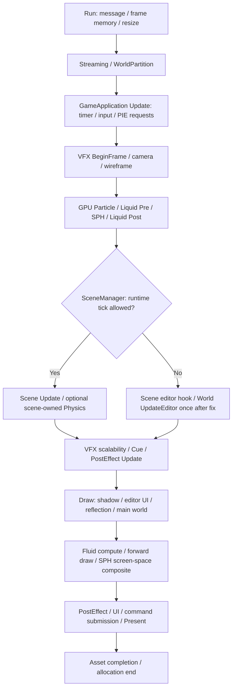

# Engine frame execution audit

調査日: 2026-08-27。基準: master `823c3d4`、作業ブランチ `codex/frame-execution-audit`。

[サービス所有・寿命の棚卸し](EngineServiceLifetimeAudit.md)を引き継ぎ、実装の呼出箇所を確認した。[初回構造調査](EngineArchitectureAudit.md)は当時の記録として残す。本書の「基準版」は変更前、「修正後」は今回の小変更を指す。実行順の確認と、実機で検証できた範囲は区別する。検証結果は[進捗](ProductionEngineProgress.md)に記録する。

## 結論と今回の範囲

- フレーム全体を同じ時計・同じ停止条件で進める仕組みはない。Scene、CPU Physics、GPU Particle、SPH、Fluid、WaterのEditor表示は別々の更新契約を持つ。
- CPUの呼出順とGPUの実行完了は異なる。Update内のComputeもまずCommandListへ記録され、通常の送信・PresentはDraw末尾。Shaderの各DispatchをCPUの即時実行と解釈しない。
- 明確で修正範囲が小さいのはSampleSceneのEditor World二重更新。Scene固有hookではWorldを更新せず、既存のSceneManager担当へ揃える。
- SceneのPhysics所有・可変/固定刻み、GPUの更新位置、Water/VFXのプレビュー、PIE停止方針、RenderGraphのpass順は今回変更しない。Actor/ComponentにFixedUpdateを追加せず、Manager/Singletonも追加しない。
- SampleSceneのEdit/Pauseに限り、従来二重だったComponent更新を1回にする。その結果、時間を進めるEditor Componentも二重には進まなくなる。Waterを含め「すべての観測値が変更前と同じ」とは主張しない。Component自体の処理と他Sceneの回数は維持する。

## 1. 通常の1フレーム

実行入口は[Framework.cpp](../Project/Engine/Core/Application/Framework.cpp)の`Run`、仮想呼出先は[GameApplication.cpp](../Project/ApplicationLayer/GameApplication.cpp)の`Update`/`Draw`。

| 順序 | 呼出 / 処理 | データ・境界 |
| ---: | --- | --- |
| 0 | Run前のInitialize、各ループ入口のWinApp::ProcessMessage | 終了要求ならそのフレームを実行せずFinalizeへ |
| 1 | FrameMemory::BeginFrame → FrameAllocationTracker::BeginFrame | Updateだけでなく表示設定・Drawまでを含むEngine側の範囲 |
| 2 | fullscreen/display要求 → resize、ResolutionManager・default Camera aspect更新 | 必要時のみ。resizeの待機は通常フレームの固定処理とは別 |
| 3 | StreamingManager::Update → WorldPartitionManager::Update | Worker完了をMainへ反映。Cameraの通常更新より前なので前回のactive camera位置を利用 |
| 4 | GameApplication::Update → GameTimer::BeginFrame / BeginUpdate → Input::Update | deltaTimeはFPSCounterの前回BeginFrameから今回までの実時間 |
| 5 | EditorModeController::Update → SceneManager::ProcessEditorPlayRequests | USE_IMGUIのみ。前DrawのPIE要求・Editor遅延操作をここで処理 |
| 6 | VfxCueRuntime::BeginFrame → VfxGraphRuntime::BeginFrame → defaultCamera::Update | Cueの前回presentation offsetを戻し、Graphの当フレーム予算統計をreset |
| 7 | Framework::Update: CameraManager::Update → Wireframe::Update | Scene/Camera Component更新より前 |
| 8 | GpuParticleManager::Update(dt) | 既存粒子UpdateとEmitter emitを記録。Sceneで今回変更するEmitter位置/要求はまだ未反映 |
| 9 | Liquid::PreSphUpdate(dt) → GpuSphManager::Update(dt) → Liquid::PostSphUpdate | Ocean/LOD/反復予算 → SPH substep → Secondary分類・Ocean feedback。Scene Updateより前 |
| 10 | SceneManager::Update | 遷移処理の後、条件に応じRuntime Scene更新かEditor更新の片方 |
| 11 | VfxGraphRuntime::UpdateScalability → VfxCueRuntime::Update(dt, currentWorld) | Scene更新後のCamera/Worldを参照。Cue/GraphからParticleへの新規要求は通常次回Particle更新で消費 |
| 12 | PostEffectManager::Update → JsonEditorWindow::Update → GameTimer::EndFrame | このEndFrameはupdatePhaseActiveを見てEndUpdate相当でreturnする。フレーム二重確定ではない |
| 13 | GameApplication::Draw → GameTimer::BeginDraw → RenderPipelineController::ExecuteFrame | 詳細は次節。SceneのRuntime Updateを再呼出しない |
| 14 | GameTimer::EndDraw / BeginPresent → DirectXCommon::EndDraw → EndPresent / EndFrame | CommandList送信、Present、fence安全化、次Frame準備。ここで時間を確定 |
| 15 | VfxGraphDiagnostics::CaptureFrame | 確定した同じフレームの時間統計を取得 |
| 16 | Framework::Runへ戻りAssetSystem::Update → FrameAllocationTracker::EndFrame | 送信後のAsset async反映・GC・deferred release |

GameTimerの2つのEndFrameの意味は[GameTimer.cpp](../Project/Engine/Core/Time/Core/GameTimer.cpp)、deltaTimeの生成は[FPSCounter.cpp](../Project/Engine/Core/Time/LegacyFPSCounter/FPSCounter.cpp)で確認。名前の整理は可能だが、今回は計測APIも変更しない。

## 2. Scene、Actor/Component、Physicsの順序

### SceneManagerの分岐

[SceneManager.cpp](../Project/Engine/Scene/Management/SceneManager.cpp)の`Update`はまず`sceneTransition_->Update(min(dt, 1/30))`、必要なUnload/Swap/Load/Crackを処理する。`scene_ && (!isTransitioning_ || sceneSwapped_)`でない場合、World更新は行わない。一方、その前に実行したFrameworkのGPU更新はこの遷移gateの対象外。

USE_IMGUIでは`IsGamePreviewMode() || IsPlaying() || editorSingleStepRequested_`のとき`scene_->Update()`、そうでなければ`scene_->UpdateEditor(dt)`→`RefreshEditorVisualState(dt)`→`GetEditorActorWorld()->UpdateEditor(dt)`。RuntimeとEditorの両方を呼ぶ分岐ではない。Step要求はPause状態を維持したままこの1回のRuntime tickだけを許可し、Update末尾で要求を消す。USE_IMGUIがないReleaseはRuntime経路。

| Scene | Runtime更新 | Edit/Pause更新 | Physics |
| --- | --- | --- | --- |
| DebugScene | ActorWorld.Update → pre-physics dirty transform確定 → PhysicsWorld.Update → ActorWorld.PostPhysicsUpdate → post-physics dirty transform確定 | Scene hookは検証要求を処理。WorldはSceneManagerから1回 | SceneがPhysicsWorldを値所有。InitializeでSetPhysicsWorldし、**SetUseFixedStep(false)**。通常はclampしたdtでStepを1回 |
| DataDrivenScene | ActorWorld.Updateのみ | Scene hookはno-op、SceneManagerからWorldを1回 | PhysicsWorldの所有・SetPhysicsWorld・Step・PostPhysicsUpdateなし |
| SampleScene（基準版） | ActorWorld.Updateのみ | Scene hookからWorldを1回、SceneManagerからもう1回 | DataDrivenSceneと同様、Physics Stepなし |
| SampleScene（修正後） | 変更なし | Scene hookはno-op、SceneManagerからWorldを1回 | 変更なし |

根拠: [DebugScene.cpp](../Project/ApplicationLayer/Scene/DebugScene/DebugScene.cpp) `Initialize / SetupWorldSystemSchedule / UpdateEditor`、[DataDrivenScene.h](../Project/Engine/Scene/Management/DataDrivenScene.h)、[SampleScene.h](../Project/ApplicationLayer/Scene/SampleScene/SampleScene.h)。DebugSceneの5 systemはいずれもMainThread指定で、共有resourceのread/write依存によって上記順になる。JobSystemがあることを理由にActorやPhysicsが並列更新されるとは扱わない。

### Actor/Component

[ActorWorld.cpp](../Project/Engine/Scene/Actor/Core/ActorWorld.cpp)のRuntime順は、pending reload/spawn → Actor登録順に有効・未削除ActorのComponent初期化 → Actor.Update → 追加Component初期化 → pending destroy/add処理 → Light同期。Editor順も同じWorld lifecycle経路で、Actor.UpdateEditorを呼ぶが、RuntimeのようなActor更新直後の2回目のInitializeComponentsはない。

[Actor.cpp](../Project/Engine/Scene/Actor/Core/Actor.cpp)の基底実装では、Update / UpdateEditor / PostPhysicsUpdateとも`GetUpdateOrder()`のstable sort。等しいorderはComponent登録順、有効な階層だけを更新する。派生Actorのoverrideが基底を呼ぶ位置は派生実装の責任。WorldのPostPhysicsUpdateは全Actorを1回走査し、全substep終了後のLight同期まで行う。

[ActorComponent.h](../Project/Engine/Scene/Actor/Core/ActorComponent.h)とActorには共通FixedUpdateがない。現在のPostPhysicsUpdateはPhysics substepごとのcallbackではない。Scene側でPhysicsを固定刻みに切り替えても、Component.Updateが固定刻みになるわけではない。

### PhysicsWorldの内部step

[PhysicsWorld.cpp](../Project/Engine/Physics/Core/PhysicsWorld.cpp) `Update / Step`:

1. dtを`[0, maxDeltaTime]`にclamp。非固定ならaccumulatorを0にしStepを1回（dt=0でも入口は呼ぶ）。
2. 固定ならaccumulatorへ加算し、fixedTimeStep以上の間、最大maxSubSteps回。上限到達後も1step以上余っていればaccumulatorを0にする。
3. 各StepはContact clear → Rigidbody frame state clear → body積分 → 速度clamp → Collider位置積分 → collision検出 → contact解決 → sleep更新 → collision event dispatch。

既定は1/60秒・最大4 substeps・dt上限0.1秒だが、DebugSceneは非固定へ明示変更する。DataDrivenScene/SampleSceneに勝手にPhysicsWorldを追加すると既存Actorの移動や衝突が変わるため、Scene/Level単位の要件・移行テストが必要。

## 3. GPU Particle / SPH / Liquid / Fluid / VFX / Water

| 系統 | 実際の入口と順序 | 時計・依存 |
| --- | --- | --- |
| GPU Particle | Framework.Update → buffer更新 → Emitter activity/CB構築 → 既存粒子Update（空なら省略）→ emit Dispatch | GameTimer dt。GPU update入口にPIE gateなし。Manager::Drawは描画であり積分しない |
| SPH | Liquid Preの後、readback/reset → accumulatorに応じsimulation step → CFL/DFSPH診断readback予約 | 既定1/120秒・最大4、設定上限16。Adaptive CFLによるeffective dtあり。CPU Physicsとは独立 |
| SPH step | gravity → predict → predicted boundary → spatial hash → density → DFSPH projectionまたはpressure → viscosity → integrate → position boundary | 内部UAV barrierを保ち順に記録 |
| Production Liquid | Pre: Camera focus/LOD、前回SPH統計から予算、Ocean sampleとcoupling。Post: Secondary分類・統計・Ocean feedback | Scene/Water Updateより前のprovider状態を読む。SPHのpausedフラグ自体ではPre/Postは停止しない |
| 2D Fluid | ActorWorld.Draw → UpdateFromWorld → source/obstacle収集 → accumulator/substep → Forward packet登録 | 今回のActor/Physics後の状態。同一World・frame slot/fenceの重複gateあり |
| 3D Volumetric Fluid | 2Dの後にUpdateFromWorld → Forward packet登録 | default OFF。OFF中はsource診断のみ、ON時にlazy初期化。独立accumulator、同様の重複gateあり |
| Fluid各step | obstacle raster → injection → velocity advection → pressure projection → scalar advection → forces → 再projection | 2D/3Dの既存順を維持。DrawがないWorldではこの更新もない |
| SPH–Rigidbody | MainWorldRender冒頭のReflectionProbeSceneBridge::CapturePending → Interaction.Update | Reflection要求がなくてもhookに入る。CPU Physics後のproxy、以前のslotのreactionをCPU velocityへ反映 → 今回のcollision compute/readback予約。SPH内部substepループとは別 |
| VFX | Cue BeginFrameのpresentation復元 → Scene中の発火/位置設定 → Graph scalability → Cue timeline/adapters | Cue dtは非負/finite確認と0.25秒clamp。PIE状態のgateはない。Graph/Timeline Editorのpreviewも同じRuntimeを使用 |
| WaterSurface | Component.Update / UpdateEditorでwaterTime加算とmaterial同期、PostPhysicsUpdateでもmaterial同期 | Edit/Pauseでも水面previewが進む実装。WaterInteractionのUpdateEditorはCollider表示同期で、Runtimeの浮力/dragとは別 |
| PostEffect | UpdateはregistryのEditor-enabled effectを更新。Draw末尾にSPH screen-space合成し、その後effect chain | Runtime有効とEditor有効の役割は既存のまま。PIE gateなし。SPH合成は粒子solverを再stepしない |

根拠:

- [GpuParticleManager.cpp](../Project/Engine/Graphics/Renderer/GpuParticle/Manager/GpuParticleManager.cpp) `Update / Draw`、[GpuParticleComponent.cpp](../Project/Engine/Scene/Actor/Components/GpuParticleComponent.cpp) `Update`。
- [GpuSphManager.cpp](../Project/Engine/Graphics/Renderer/GpuFluid/Sph/Manager/GpuSphManager.cpp) `Update / ExecuteSimulationStep`、[GpuProductionLiquidManager.h](../Project/Engine/Graphics/Renderer/GpuFluid/Liquid/Manager/GpuProductionLiquidManager.h) `PreSphUpdate / PostSphUpdate`。
- [GpuFluidManager.cpp](../Project/Engine/Graphics/Renderer/GpuFluid/Manager/GpuFluidManager.cpp)、[GpuVolumetricFluidManager.cpp](../Project/Engine/Graphics/Renderer/GpuFluid/Volumetric/Manager/GpuVolumetricFluidManager.cpp) `UpdateFromWorld / ExecuteSimulationStep`。
- [GpuSphRigidbodyInteraction.h](../Project/Engine/Graphics/Renderer/GpuFluid/Sph/Interaction/GpuSphRigidbodyInteraction.h) `Update / ConsumeCompletedReadback`、[ReflectionProbeSceneBridge.h](../Project/Engine/Graphics/Renderer/Reflection/ReflectionProbeSceneBridge.h) `CapturePending`。
- [VfxCueRuntime.cpp](../Project/Engine/Vfx/Runtime/VfxCueRuntime.cpp)、[VfxGraphRuntime.cpp](../Project/Engine/Vfx/Graph/Runtime/VfxGraphRuntime.cpp)、[WaterSurfaceComponent.h](../Project/Engine/Scene/Actor/Components/WaterSurfaceComponent.h)、[WaterInteractionComponent.h](../Project/Engine/Scene/Actor/Components/WaterInteractionComponent.h)、[PostEffectManager.cpp](../Project/Engine/Graphics/PostEffect/Manager/PostEffectManager.cpp)。

### PIE停止・Single Stepの確認

以下は通常のScene更新可能状態。GPU処理の「継続」は資源・有効source・設定等の条件を満たす場合で、常にDispatchするという意味ではない。

| 系統 | Editor Edit | PIE Play | PIE Pause | PIE Single Step |
| --- | --- | --- | --- | --- |
| Scene / Actor Runtime Update | 停止 | 1回 | 停止 | 1回だけ許可。その後Pauseのまま |
| ActorWorld.UpdateEditor | 1回（Sample基準版は2回） | 呼ばない | 1回（Sample基準版は2回） | そのtickは呼ばない |
| DebugScene CPU Physics | 停止 | Scene scheduleから1回 | 停止 | Scene scheduleから1回。共通fixed step要求ではない |
| GPU Particle | 継続 | 継続 | **継続** | 通常dtの更新。PIE stepとは連動しない |
| SPH solver | 独自pause/step設定に従う | 同左 | **PIE Pauseだけでは止まらない** | 独自accumulator次第で0〜複数step。PIE StepはRequestSingleStepを呼ばない |
| Liquid Pre/Post | 有効条件に従い継続 | 同左 | 継続 | 継続 |
| 2D/3D Fluid | Draw時、独自pause/step設定に従う | 同左 | **PIE Pauseだけでは止まらない** | PIE Stepと独立 |
| SPH–Rigidbody interaction | Editor Editのgateで停止 | 有効なら実行 | **IsEditingではないため実行対象** | 同じく実行対象 |
| WaterSurface表示 | UpdateEditorで時間進行 | Updateで時間進行 | UpdateEditorで時間進行 | Runtime Updateで時間進行 |
| VFX Cue / Graph scalability / PostEffect | 継続 | 継続 | 継続 | 通常dtで継続 |

[EditorPlayController.cpp](../Project/Engine/Editor/EditorPlayController.cpp)のPause/Stepは遅延要求で、SceneManagerが消費する。SPH/2D/3D Fluidの`SetPaused / RequestSingleStep`外部呼出は各DiagnosticsPanelにあり、PIE制御からは接続されていない。したがって「PIE Pauseで全Simulation停止」「Single Stepで全Subsystemが同じ時間だけ進む」は現状保証できない。

WaterやVFXのEditor preview継続までまとめて停止すると編集機能を変える。将来はEditor previewとRuntime simulationの対象、clock、停止時のreadback適用、積算時間の扱いを先に決める。今回dtを一律0にする変更はしない（SPHのdt<=0 early returnは独自Single Stepすら処理しない）。

## 4. Render / Presentと複数Draw

[RenderPipelineController.cpp](../Project/Engine/Graphics/Pipeline/RenderPipelineController.cpp) `ExecuteFrame`は隣接passに明示依存を張る。Editor/gameは同一frameで両方実行するものではなく、modeで片方を選ぶ。

| 経路 | 順序 |
| --- | --- |
| 共通 | GPU timing回収/開始 → BeginDraw → ShadowPrepare → ShadowRender |
| Editor | EditorUiBuild → EditorPicking → MainWorldRender → PostEffect → SelectionOutline → SceneOverlay → ImGuiRender |
| Game / Release | MainWorldRender → BackBufferPostEffect → BackBufferRebind → GameUi |
| MainWorldRender内部 | SPH–Rigidbody interaction → Probe同期/capture → Planar同期/capture → PostEffect BeginDraw（Scene target）→ Scene 3D → Wireframe → PostEffect EndDraw（SPH screen-space合成） |
| ActorWorld.Draw内部 | Light同期 → ForwardQueue BeginFrame/Component packet収集 → GPU Particle packet → 2D Fluid update/packet → 3D Fluid update/packet → Opaque → Masked → 未移行Component/派生Actor Draw → Transparent → Additive → Queue EndFrame |

ShadowはLightManagerがcaster callbackを複数回呼び得るが、経路はActorWorld.DrawShadow。Probeはstatic ModelのDrawReflectionCapture、PlanarはReflectionCaptureDrawableの描画であり、ActorWorld.Drawを再帰呼出ししない。Editor Picking / SelectionOutlineも専用描画経路。`PrepareRenderState`の繰返しはLight同期でありWorld Updateではない。

Graph失敗時は同順の固定fallbackがある。[RenderGraph::Execute](../Project/Engine/Graphics/RenderGraph/RenderGraph.cpp)は現在、Compile失敗ならcallback実行前にfalse、callback列の後はtrue。通常経路で「一部描画済みをfalseとして全fallback再実行」する実装ではない。callback例外を正常なfallback成功とは扱わない。

### 同一フレームで再描画した場合

| 対象 | 確認結果 / 限界 |
| --- | --- |
| Actor/Component Runtime Update、CPU Physics、Particle/SPH本体、Liquid、Cue | Drawから通常Update入口を呼び直さない。Drawだけ増やしてもその入口の回数は増えない |
| 2D/3D Fluid | activeWorldアドレス、current frame index、そのslotのfence valueが同じならUpdateFromWorldをreturn。単なるframe indexのみの判定ではないため、slotが巡回しても次frameを許可 |
| Fluidの限界 | 単一activeWorldのcache。A→B→Aの複数World描画ではWorld変更時のreset/updateが起こる。World pointer再利用・Finalize/reconfigure・途中submitまで含む全描画契約を保証するものではない |
| SPH–Rigidbody interaction | **同一frame重複gateなし**。MainWorldRender/CapturePendingを2回呼べばcollision dispatchとpending readback消費/再予約へ2回入る。2回目には未送信のreadbackを消費し得る。slotはGPU待機後に1回使う前提 |
| Probe/Planar/Shadowを現在の通常経路で増やす場合 | 上記専用描画なのでFluid更新もinteraction hookもface/casterごとに再呼出ししない。現在のRunはMainWorldRenderを1回のみ呼ぶ |
| GameApplication::DrawをPresentごと2回呼ぶ場合 | EndDrawでsubmit/次frame準備まで進む。Fluid gateのいうGPU frameが別になるため、1 Updateに対して2回進む可能性がある。Runは現在この使い方をしない |
| GPU ParticleのDraw内/Forward packet内Compute | rendererのcompact/sortなど描画準備はあり得るが、粒子寿命の積分・emitとは区別する。複数描画を「Computeが全く走らない」とは表現しない |

根拠: [ActorWorld_Draw.cpp](../Project/Engine/Scene/Actor/Core/ActorWorld_Draw.cpp)、[PlanarReflectionSceneBridge.h](../Project/Engine/Graphics/Renderer/Reflection/PlanarReflectionSceneBridge.h)、上記Fluid/interaction実装。

[DirectXCommon.cpp](../Project/Engine/Graphics/Device/Facade/DirectXCommon.cpp)のEndDrawはRT終了 → PRESENT transition → CommandManager.Execute（Close/submit）→ Present(1,0) → fence signal/wait → allocator/list reset → 次frame upload開始。[DX12CommandManager.cpp](../Project/Engine/Graphics/Device/Command/DX12CommandManager.cpp)はFrames in Flight OFFでも送信slotのfence valueを更新する。ONでは次slotのfenceだけを待ち、OFFでは今回の送信完了まで待つ。Fluidのguardはこの境界を利用する。BeginDraw自体はbackbuffer index更新であり、simulation frame開始APIではない。

## 5. 分類・リスク・今回の判断

分類と「今回直すか」は別に記録する。バグと確認しても、停止契約やGPU寿命へ波及するものはこの変更に混ぜない。

| ID | 分類 | 事実 / 問題 | 変更リスク・効果 / 今回の判断 |
| --- | --- | --- | --- |
| FRAME-01 | 維持 | RunのUpdate→Draw→Asset反映、RenderGraphの既存直列順 | 変更リスク高。GPU資源/画面結果に関わるため順序維持 |
| FRAME-02 | 明確なバグ | SampleSceneのEditor World更新が2回 | 低リスク。Scene hookの重複だけ除去し、DataDrivenSceneと同じ担当に揃える。プレビュー二重進行を解消 |
| FRAME-03 | 設計改善候補 | DebugSceneだけPhysicsWorldを所有/stepし、しかも非固定。DataDriven/Sampleにはstepなし | 高リスク。単純なstep追加では移動/衝突が変わる。SceneごとのPhysics要件を決めるまで維持 |
| FRAME-04 | 今回変更しない | Actor/Component共通FixedUpdateなし | 新APIや全Actor移行は範囲外。現在のUpdate/PostPhysicsUpdate契約を維持 |
| FRAME-05 | 設計改善候補 | Particle/SPH/LiquidがSceneより先。今回のEmitter/Water変更を通常次のGPU更新が読む | 高リスク。移動すると発火・水面連成・solver入力時刻が変わるため維持 |
| FRAME-06 | 設計改善候補 | Fluid computeがDrawにあり、可視/描画有無と更新が結び付く | 高リスク。現在は最新Collider/Emitterを使う利点あり。World単位の更新所有とGPU frame定義を先に決める |
| FRAME-07 | 明確なバグ | PIE Pause/Single StepでRuntime CPUとGPUの停止・進行が揃わない | 中〜高リスク。停止保証の欠落は確認できるが、Editor previewとの分離、reaction/readbackを含む修正は保留。今回の安全な修正に含めない |
| FRAME-08 | 明確なバグ | MainWorldRender再呼出時、SPH interactionに重複実行/未送信readback消費を防ぐgateがない | 条件付きの不具合。通常は1回で到達。GPU資源slot・World切替・readbackの実測とセットで直す必要があり今回は保留 |
| FRAME-09 | 維持 | Fluidの同一World/slot/fence gate、各solver内部のpass順 | 重複防止は既存機能を使う。新しいglobal frame counterは追加しない |
| FRAME-10 | 今回変更しない | Water UpdateEditor、VFX preview、PostEffectがPIE停止と別に進む | 表示用更新を一括停止しない。SampleSceneの重複除去以外に時計を変えない |
| FRAME-11 | 設計改善候補 | GameTimer::EndFrameがUpdate終了とframe終了を兼用、WorldPartitionがCamera更新前 | 二重frame確定ではない。意図を文書化し、計測API・Streaming入力時刻は維持 |
| FRAME-12 | 設計改善候補 | Sceneの破棄/差替えはFrameworkのGPU compute記録後にも起きる | 前回の寿命調査から継続。submitted workのwaitだけで当frame未送信参照まで安全とは限らない。例外/Scene切替反復を含むGPU寿命検証へ持越し |

## 6. 確認方法と残す検証項目

今回の最小修正はSampleSceneのhookだけに限定する。SceneManager、ActorWorld、Actor/Component、Physics、GPU系、EditorController、RenderGraphの製品実装は編集しない。

検証はDebug/Releaseの通常Build、既存module/asset/reference/CI検査、製品の短時間起動・通常終了smokeを実施し、実際の結果を進捗へ追記する。追加の呼出回数検証は本物のSceneManager/SampleScene/ActorWorld/Actor/Component経路を使い、単に期待する順序を別実装で再現したものを合格根拠にしない。

残す検証: PIE中にGPU Particle/SPH/Fluidを同時に有効にしたPause/Step比較、Water/VFXの目視、GPU debug layer、Frames in Flight ON/OFF、同一frameのMainWorldRender再実行、A/B World交互描画、Scene切替/resize/reconfigure/readback反復。コード上の到達確認だけでこれらの実機検証完了とはしない。
